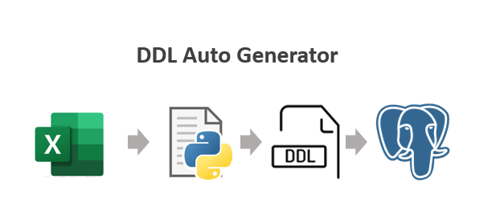

# DDL Auto Generator

## Description
The Excel to SQL Converter is a Python script designed to streamline the process of translating Excel data into SQL database tables. This tool is particularly useful for teams that need to quickly create Proofs of Concept (POCs) or make frequent updates to their data models. By automating the conversion of Excel data into Data Definition Language (DDL) scripts and populating the database tables, this script enhances efficiency, reduces manual errors, and fosters better collaboration between technical and non-technical team members.

### Features
* **Excel to SQL Translation:** Converts Excel spreadsheets into SQL DDL scripts.
* **Automated Table Creation:** Generates SQL commands to create database tables.
* **Data Population:** Populates the newly created tables with data from the Excel file.
* **Quick POCs:** Facilitates rapid creation and modification of data models for POCs.
* **User-Friendly:** Designed for ease of use by both technical and non-technical users.

## How to use it 

**1. Install Requirements**

First, install the necessary dependencies by running:

    pip install -r requirements.txt

**2. Set Up the Test Database**

Build a Docker container for a PostgreSQL test database. You can also modify the credentials to connect to another PostgreSQL database. Note: The script will drop all tables from the selected database to avoid errors during the creation of new tables.

**3. Prepare Your Excel File**

Populate the ddl_auto_generator/input/Example_Excel_File.xlsx with the tables and data you want to insert. Each sheet in the Excel file will represent a table, and the first row of each sheet will be the columns for that table.

**4. Verify Database with Adminer**

Use the Adminer tool included in the Docker container to verify the database. Log in with the provided credentials and ensure that the database is empty.

**5. Run the Script**

Execute the ddl_auto_generator.py script. You can monitor the progress in the terminal.

    python ddl_auto_generator.py

**6. Verify Data in Adminer**

Check again in Adminer to ensure that the data has been correctly inserted into the database.

**7. Review Generated DDL Scripts**

The DDL scripts will be stored in the ddl_auto_generator/ddl folder for your review.